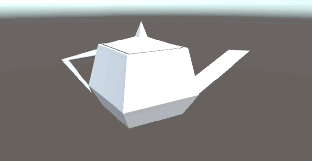
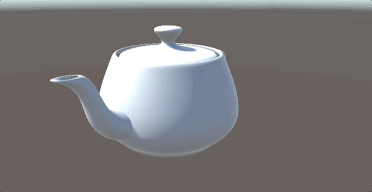

# ReadMe

## Utah Teapot

Implementation details:

- Beizer Patch as Utah teapot
- #if UNITY_EDITOR patch divs real time update in editor mode
- Procedural Mesh Generation
- Simple Orbit Camera

Math and data : [Bézier Curves and Surfaces: the Utah Teapot](https://www.scratchapixel.com/lessons/geometry/bezier-curve-rendering-utah-teapot/bezier-surface.html)