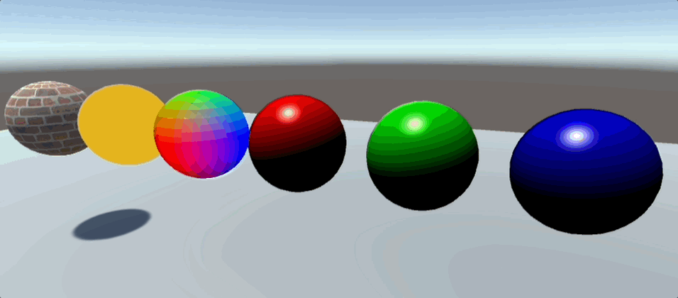

# ReadMe

## Utah Teapot

Implementation details:

- Beizer Patch as Utah teapot
- #if UNITY_EDITOR patch divs real time update in editor mode
- Procedural Mesh Generation
- Simple Orbit Camera

Math and data : [Bézier Curves and Surfaces: the Utah Teapot](https://www.scratchapixel.com/lessons/geometry/bezier-curve-rendering-utah-teapot/bezier-surface.html)

## Basic Material & Shader

Built in Render pipeline with:

- Albedo Texture
- Unlit Material
- Normal as Color Shader
- Phong Lighting Shader
- Rotate Directional Light

## Shader Graph